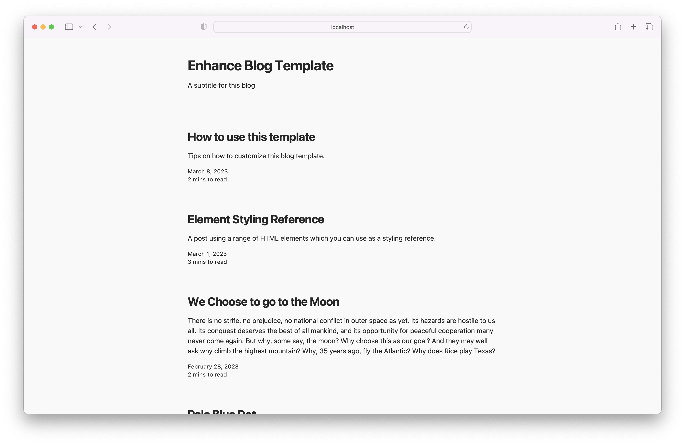
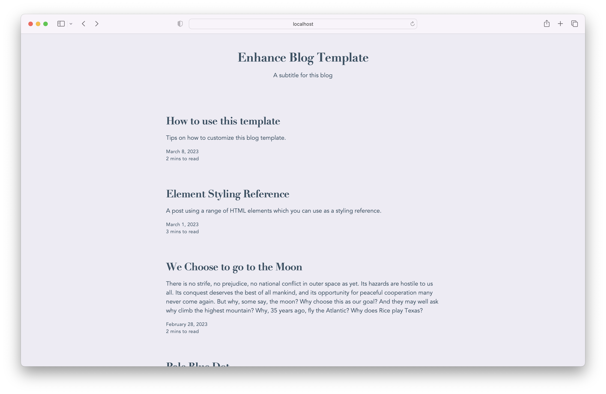
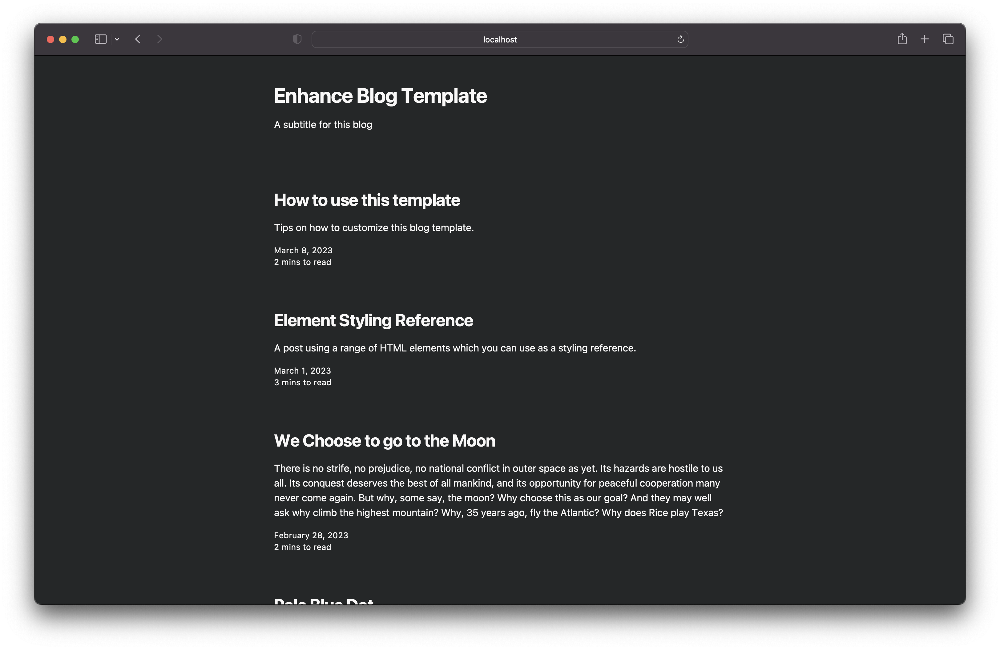
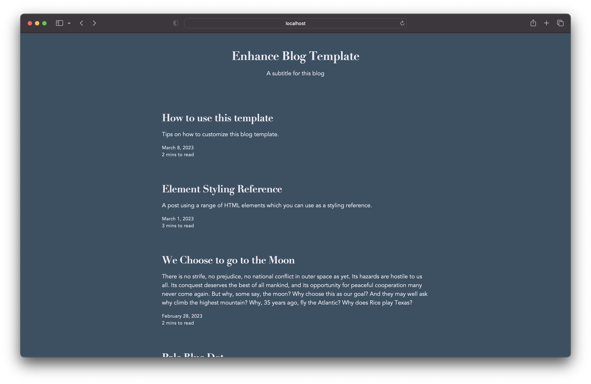

# enhance-blog-template

This is the repo containing the blog template project using Enhance.

```
app
├── api ..................... data routes
│   ├── admin
│   │   ├── index.mjs ....... load data for admin route
│   │   └── webmentions.mjs . approve webmention
│   ├── posts
│   │   └── $$.mjs .......... load data for individual blog post
│   ├── index.mjs ........... list of blog posts
│   ├── login.mjs ........... verify login
│   ├── logout.mjs .......... log out user
│   ├── rss.mjs ............. rss feed
│   └── webmention.mjs ...... incoming webmention
├── blog
│   └── posts ............... post files in markdown format
│       └── *.md
├── elements ................ custom element pure functions
│   └── *.mjs
├── lib
│   ├── hljs-line-wrapper.mjs
│   └── markdown-class-mappings.mjs
├── pages ................... file-based routing
│   ├── posts
│   │   └── $$.mjs .......... individual blog post
│   └── index.mjs ........... list of blog posts
└── head.mjs ................ head tag for each page
jobs
├── events
│   ├── check-webmention .... check new rss item for a webmention
│   ├── incoming-webmention . accept incoming webmention
│   └── outgoing-webmention . send outgoing webmention
└── scheduled ............... scheduled functions
    └── check-rss ........... look for new rss items
shared ...................... code shared between app and jobs
├── posts.mjs ............... database methods for rss items
└── webmentions ............. database methods for webmentions
```

## Quick Start

- Clone this repo:

  ```bash
  git clone git@github.com:enhance-dev/enhance-blog-template.git
  ```

- cd into the repo and do an npm install

    ```bash
    cd enhance-blog-template
    npm install
    ```
- Start the development server.

    ```bash
    npm start
    ```
 - Open a browser tab to http://localhost:3333
 - Start editing your blog

 ## Deploy to Production

> 🚨 Don't forget to run: `npm run posts` and `npm run rss` to generate the static JSON before deploying.

- [Install](https://begin.com/docs/getting-started/installing-the-begin-cli) the Begin CLI.
- Login to Begin

    ```bash
    begin login
    ```

- Create your application and staging environment by following the interactive prompts:

    ```bash
    begin create
    This project doesn't appear to be associated with a Begin app
    ? Would you like to create a Begin app based on this project? (Y/n) · true
    ? What would you like to name your app? · blog-template
    ? What would you like to name your first environment? · staging
    Archiving and uploading project to Begin...
    Project uploaded, you can now exit this process and check its status with: begin deploy --status
    Beginning deployment of 'staging'
    Packaging build for deployment
    Publishing build to Begin
    Build completed!
    Deployed 'staging' to: https://blog-template.begin.app
    ```
- [Optional] create a production environment.

    ```bash
    begin create --env production
    App environment 'production' created at https://blog-template-prod.begin.app
    ```

## Styling

This repo comes preloaded with two basic themes:

| | Minimal | Elegant |
| - | - | - |
| light |  |  |
| dark |  |  |

To switch from one theme to another, change the filename referenced under the `@enhance-styles` pragma in the `.arc` file:

```
@enhance-styles
config theme-minimal.json
```

These themes are intended as basic starting points for your own customization. To learn more about how to style your blog, [check out this deep dive on the Begin blog](https://begin.com/blog/posts/2023-04-06-customizing-the-enhance-blog-template)!

## Configuring CI/CD

This repo comes with a GitHub action that will deploy our site to `staging` when there is a commit to the `main` branch and `production` when you tag a release.

For this to work you must [create a repo secret](https://docs.github.com/en/actions/security-guides/encrypted-secrets#creating-encrypted-secrets-for-a-repository) named `BEGIN_TOKEN`. Once you successfully login to Begin using the CLI command `begin login` you can retrieve the value for `BEGIN_TOKEN` in the file `~/.begin/config.json`. Use the value of `access_token` in this file as the value for `BEGIN_TOKEN`.

Additionally to ensure you `/rss` feed points to the correct environment you will need to create two additional repo secrets.

- `SITE_URL_STAGING`: set to the url you received when creating the `staging` environment
- `SITE_URL_PRODUCTION`: set to  the url you received when creating the `production` environment

## Setting up WebMentions

> Webmention is a W3C recommendation that describes a simple protocol to notify any URL when a website links to it, and for web pages to request notifications when somebody links to them.

The `enhance-blog-template` supports both incoming and outgoing webmentions. To enable this funcationality, complete the following steps:

- Add your information to `app/api/h-card.json`. The template will add a `h-card` to each of your blog posts. This will allow remote sites to discover information about you when you link to them. Only include what information you feel comfortable in sharing. A good default would be name, photo and url. For example:

    ```json
    {
        "name": "Simon MacDonald",
        "photo": "https://github.com/macdonst.png",
        "url": "https://bookrecs.org"
    }
    ```

    For a more detailed example see [app/api/h-card.json.example](./app/api/h-card.json.example).

- Set a password for the `/admin` route:

    ```bash
    begin env create --env staging --name SECRET_PASSWORD --value yoursecretpassword
    ```

    You can use the `/admin` route to approve incoming webmentions. They won't show up under your blog post until you approve them.
